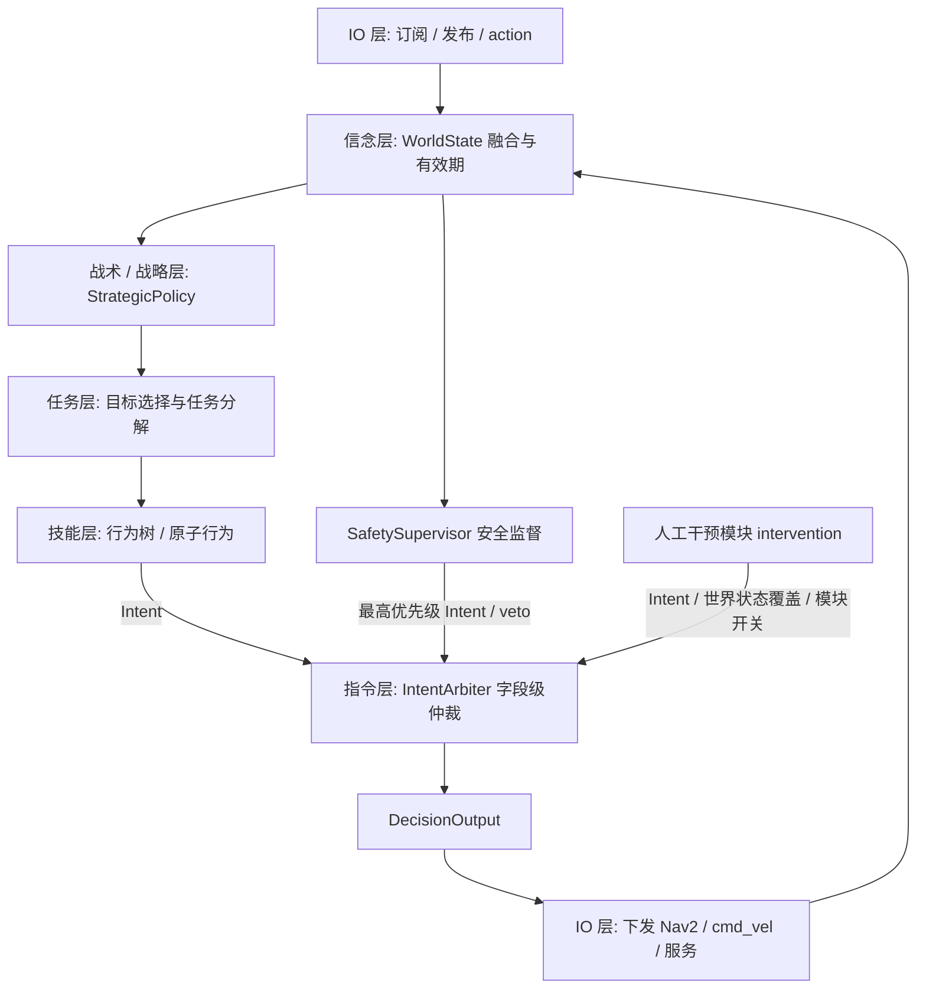
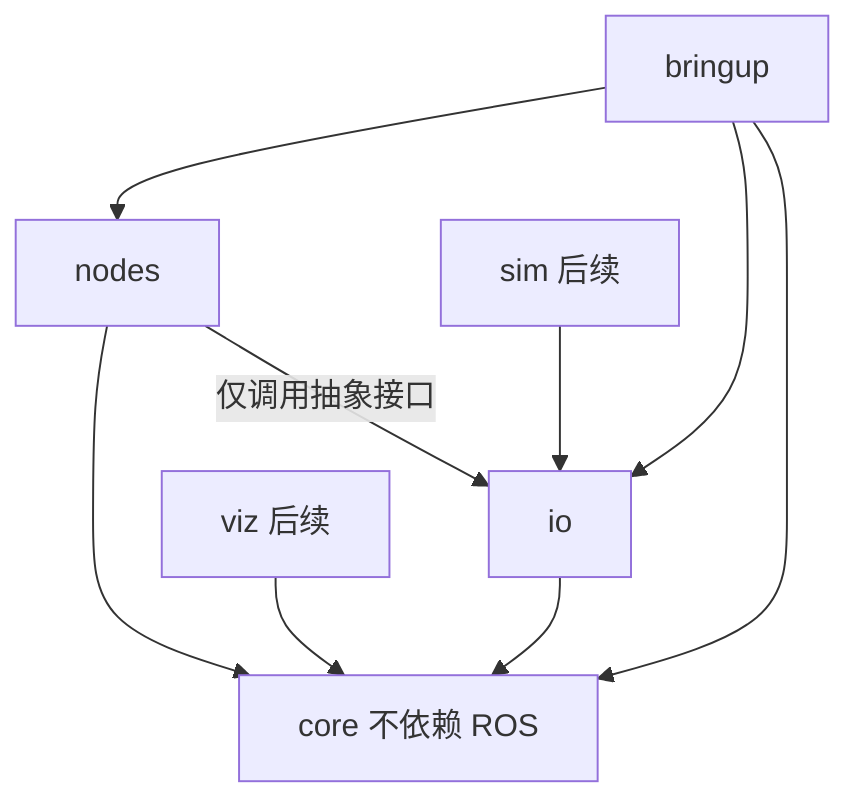
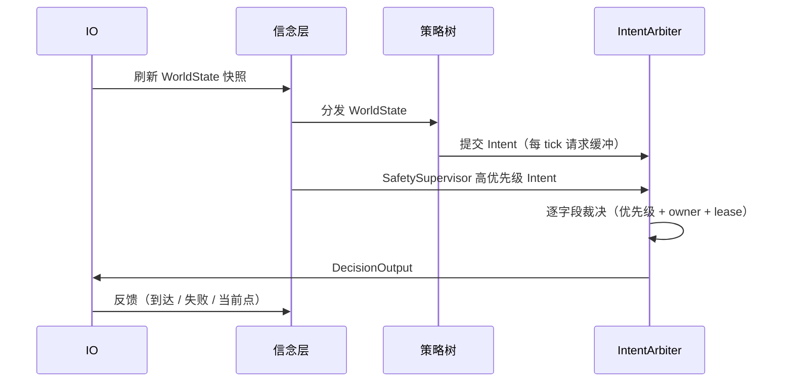

# 项目架构

> 本文档是系统的技术设计文档，也是架构的单一事实来源，面向开发者与 AI 协作者。
> 细节与杂项信息放在其他文档中并在此引用；随系统演进持续更新。

## 1. 概述

本仓库是 RM27 哨兵机器人的决策模块，负责把裁判系统、感知、导航等外部信息，转化为执行层的指令。

决策采用「信念 → 意图 → 指令」的流水线，其中「意图」进一步分为战术 / 战略、任务、技能三层。核心目标：

- **可扩展、模块化、插件式**：新增或开关一个功能模块，不影响其他模块。
- **可独立测试**：每一层都能脱离 ROS 单独测试。
- **可回放**：一场比赛结束后，只凭回放数据即可完整复现并分析决策过程。
- **安全可控**：安全 / 降级是一等公民，人为干预走受控入口，不能绕过安全。

## 2. 设计原则

- **分层解耦**：信念、意图、指令单向依赖，下层绝不反写上层。
- **依赖单向**：`core` 不依赖 ROS；行为树节点不直接调用 ROS，只读写数据契约或调用抽象接口。
- **模块化 / 插件式**：功能模块编译为独立共享库，通过清单加载，可单独开关。
- **可测试**：核心逻辑与 BT 节点是纯逻辑，可用构造好的数据直接单测。
- **回放优先**：所有决策输入与人为干预都可录制、可确定性重放。
- **单一事实来源**：优先级、字段所有权、配置集中定义，避免两套规则。
- **配置即数据**：地图、点位、区域、阈值、模块开关全部外置并做启动校验。
- **观测优先**：模式切换、意图胜负、分支抢占等决策过程必须可观测。

## 3. 总体分层



| 层 | 职责 | 输出 | 实现载体 |
| --- | --- | --- | --- |
| 信念 Belief | 解码、对齐、融合、判定有效期 | `WorldState` | core + IO 适配器 |
| 战术 / 战略 Strategic | 选择姿态（进攻 / 防守 / 兑换 / 复活） | `Posture` / `Objective` | 状态机、效用打分，可换实现 |
| 任务 Mission | 目标选择与任务分解 | `Mission` | 行为树子树 |
| 技能 Skill | 可复用的原子行为 | `Intent` | 行为树子树 / 叶子节点 |
| 指令 Command | 仲裁、限幅、互锁、超时降级 | `DecisionOutput` | `IntentArbiter` + `SafetySupervisor` |

### 3.1 信念层

信念层是决策唯一信任的世界状态。IO 层只做「解码 + 写入原始值」，融合、时间对齐、有效性判定在信念层完成。
每个输入字段都带时间戳与有效期，超时即判定为失效，并触发决策降级（见第 8 节）。

### 3.2 意图层

意图层分三层，接口逐层收窄：

- **战术 / 战略层**：只回答「现在是什么姿态」。定义为 `StrategicPolicy` 接口（输入 `WorldState`，输出 `Posture` / `Objective`）。
  当前用状态机 / 效用函数实现；将来替换为学习模型也只是换一个实现，不影响下层。
- **任务层**：把姿态展开为目标与任务序列（打前哨、守家、回血）。
- **技能层**：可复用的原子行为（去某点、追踪、脱离、购买），产生 `Intent`。

### 3.3 指令层

指令层把「树内策略意图 + 树外来源（安全、人工）」在字段级仲裁成唯一、可执行的 `DecisionOutput`。
它不产生新的策略，只做裁决、限幅与安全兜底。详见第 9 节。

## 4. 数据契约

数据契约是模块之间的唯一接口，替代旧仓库散布在 XML 端口上的字符串状态。

```cpp
// 信念：决策看到的世界
struct WorldState {
  RefereeState referee;   // 比赛阶段、基地 / 前哨血量、经济、姿态、强化时间
  SelfState    self;      // 血量、弹量、电容、脱战、当前姿态
  NavState     nav;       // 位姿、当前目标、到达 / 失败、是否在隧道
  EnemyState   enemy;     // 目标锁定、位置、可见性
  std::vector<AllyRobot> allies;
  TimePoint    stamp;     // 快照时间
  // 每个输入字段都应带时间戳 / 有效期，供信念层判定失效
};
```

```cpp
// 意图：请求，不代表最终生效
enum class IntentField { NavGoal, ChassisVel, Stance, ResourceRequest, TacticalMode };

struct Intent {
  IntentField field;
  SourceId    source;    // strategic / mission / skill / intervention / supervisor
  Priority    priority;  // 引用集中定义的优先级表
  TimePoint   stamp;
  Duration    lease{};   // 有效期，过期即失效
  IntentValue value;     // variant
};
```

```cpp
// 指令：仲裁后的唯一输出
struct DecisionOutput {
  std::optional<Point2D> nav_goal;
  std::optional<Twist>   safe_cmd_vel;
  SentryStance           desired_stance;
  ResourceRequest        resource;
  TimePoint              stamp;
  // 各字段的 owner 与默认值见第 9 节
};
```

## 5. 模块与包划分

初期只落地四个核心包，其余按需再拆，避免过早为包边界付出样板成本。

| 包 | 职责 | 依赖 |
| --- | --- | --- |
| `sentry_decision_core` | 数据契约、信念融合、仲裁、几何、日志、配置。**不依赖 ROS** | 标准库 |
| `sentry_decision_io` | 全部 ROS 交互：订阅、发布、action / service 客户端；接口抽象 + real / sim / replay 实现 | core |
| `sentry_decision_nodes` | 行为树插件模块（含 `intervention`），编译为共享库 | core、io 抽象接口 |
| `sentry_decision_bringup` | `main`、launch、参数 YAML、tree XML、插件清单 | nodes、io、core |

后续按需增加：`sentry_decision_msgs`（对外消息 / 服务 / action）、`sentry_decision_viz`（可视化）、`sentry_decision_sim`（裁判仿真）、`sentry_decision_test`（测试与回放工具）。



关键约束：行为树节点不得直接创建 ROS 节点或订阅。所有 I/O 集中在 `io` 的单一节点（建议 `rclcpp_components`），
订阅回调只做「解码 + 更新原始值」，BT tick 线程读取不可变快照。

## 6. 插件机制

使用 BehaviorTree.CPP v4 的共享库插件机制，而不是手写注册清单：

- 每个模块编译为独立 `.so`，内部用 `BT_REGISTER_NODES(factory)` 自注册节点。
- 组合根用 `factory.registerFromPlugin(lib)` 按 YAML 清单加载。
- 模块清单 `module.yaml` 声明：`enabled`、`library`、`params`、`nodes`、**提供的输出字段**、**消费的信念字段**。
- 启动时校验：XML 只引用已加载节点；每个消费字段都有生产者；否则启动即失败。
- 新增 / 删除 / 开关模块 = 增删一个库 + 改一行配置，不碰核心代码。

这样才真正实现「独立开关模块而不影响其他模块」。

## 7. 行为树规范

### 7.1 控制节点选择

| 标签 | 记忆行为 | 是否可抢占 | 用途 |
| --- | --- | --- | --- |
| `Fallback` | 记住当前孩子，不重查前序 | 否 | 一次性回退 / 恢复 |
| `ReactiveFallback` | 每 tick 从第一个孩子重扫，命中 RUNNING 时 halt 其余 | **是** | 优先级仲裁 |
| `Sequence` | 记住进度，失败重置 | 否（前序条件不重查） | 有副作用的步骤串 |
| `SequenceWithMemory` | 记住进度，失败不重置 | 否 | 可重试的任务步骤 |
| `ReactiveSequence` | 每 tick 从第一个孩子重扫 | **是** | 守卫条件 + 动作 |

### 7.2 节点注释模板

每个 BT 节点必须在头文件类声明上方包含以下模板，缺一即 CI 失败：

```cpp
// =============================================================================
// Node:         CheckEnemyOutpostHealth
// Category:     Condition (synchronous, no side effects)
// Purpose:      判断敌方前哨站血量是否低于阈值，用于前哨进攻分支。
// Inputs:       threshold: int (端口)
//               health:    int (端口, 通常来自 {referee.enemy_outpost_health})
// Outputs:      -
// Blackboard:   read: referee.enemy_outpost_health  write: (none)
// Threading:    tick 在 BT 单线程调用；无阻塞、无 ROS 调用。
// Side Effects: none
// See:          tree/nav/attack.xml -> Priority1AutoOutpostAttack
// =============================================================================
```

### 7.3 目录与清单

行为树按模块分目录，而不是按覆盖顺序堆一个巨型 XML：

```text
tree/
├── tree_manifest.yaml     # XML 与模块、启用开关，启动时校验
├── root.xml               # 只做组合，不写业务逻辑
├── tactical/{root,attack,defend}.xml
├── nav/{root,patrol,retreat,unstick}.xml
├── resource/{...}.xml
├── stance/{...}.xml
└── gimbal/{...}.xml
```

每个 XML 顶部注释写明「进入条件 / 退出条件 / 抢占关系」。

### 7.4 禁止事项

- 禁止无超时的 `RetryUntilSuccessful(-1)` 与用 `Wait` 轮询业务条件。
- 禁止在 BT 节点里直接 `std::cout` 或直接创建 ROS 对象。
- 禁止保留被注释掉的策略分支（会污染日志与可视化）。
- 禁止新增全局可变状态；所有决策状态显式放进数据契约。

## 8. 抢占

### 8.1 定义

抢占指：一个正在执行的行为 A，被此刻条件成立的更高优先级行为 B 打断，B 接管。它回答「何时停 A、开始 B」。
在 BT.CPP 中，抢占由控制节点是否每 tick 重新扫描高优先级兄弟节点决定；不再 tick 某个 RUNNING 孩子时，父节点对其调用 `halt()`。

### 8.2 可中断契约

所有异步节点必须实现 `halt()`：取消未完成的 action / 服务，清除本次行为写入的意图。否则会出现「树以为停了、机器人还在动」的幽灵行为。
副作用的发起必须是边沿触发（只在 `IDLE → RUNNING` 时发起），不能每 tick 重发。

### 8.3 示例

```text
ReactiveFallback  全局优先级
├── ReactiveSequence  紧急撤退      guard: HP < 30
│   └── SubTree 撤退到基地
├── ReactiveSequence  补充弹药      guard: 弹量 < 阈值
│   └── SubTree 基地购买
└── SubTree 巡逻                   默认
```

血量跌到阈值以下时，下一 tick 紧急撤退分支返回 RUNNING，ReactiveFallback halt 掉正在 RUNNING 的购买分支，
其 `halt()` 取消 Nav2 goal 并发起撤退目标。

## 9. 仲裁

### 9.1 位置

`IntentArbiter` 位于指令层，在「意图产生」与「IO 下发」之间，拦截的是「意图 → 指令」这一步转换。
它是 `core` 中的纯逻辑组件，不依赖 ROS，可脱离行为树单测。

策略树只能表达同一棵树内、互斥分支的优先级；仲裁器额外解决：跨模块 / 树外来源、字段级冲突、
默认值、有效期（lease）、冲突可观测与可测试。

### 9.2 优先级带

优先级集中定义，单一事实来源：

```text
safety(急停 / 看门狗) > intervention(人工干预 / 调试注入) > recovery > tactical > default
```

人工干预走 `intervention` 带，因此硬安全永远压得住人。仿真中可另开仅 `competition_mode=false` 时允许的
`debug_override` 带，用于强制测试。

### 9.3 字段所有权与 lease

| 输出字段 | owner | 允许覆盖者 |
| --- | --- | --- |
| `nav_goal` | 导航决策模块 | safety、intervention |
| `safe_cmd_vel` | recovery（仅接管时） | safety（急停） |
| `desired_stance` | 姿态模块 | safety、intervention |
| `resource` | 资源模块 | intervention |

- 非 owner 提交该字段记 `WARN`；
- 同优先级多来源冲突按显式 tie-break 解决并告警；
- lease 过期后字段回落默认值（例如「无目标」），避免机器人固执执行过时目标。

### 9.4 tick 时序



### 9.5 与抢占的关系

先树内抢占，再跨来源仲裁：树内用 `ReactiveFallback` / `ReactiveSequence` 打断同策略的低优先级分支；
被 halt 的分支本 tick 不再提交 Intent，其请求自然消失；随后仲裁器把树内意图与树外来源合并成唯一指令。
`SafetySupervisor` 使用保留的最高优先级带，并在仲裁后做最终 clamp / 急停，保证安全无法被绕过。

## 10. 人工干预模块（intervention）

人工干预封装为一个**独立模块**，与策略、安全并列，走同一条流水线，可单独开关；
初期作为 `nodes` 下的独立插件库，接口稳定后如需可提升为独立包。

### 10.1 三个注入点

| 注入点 | 改什么 | 走哪条路 | 用途 |
| --- | --- | --- | --- |
| 世界状态注入 | `WorldState` 字段（血量、弹量、阶段、敌方位置） | IO 的 Sim / Override 源 | 触发策略分支 |
| 意图注入 | 直接加一条 `Intent` | `IntentArbiter` 的 intervention 来源 | 手动接管 / 加动作 |
| 模块开关 | 启用 / 禁用插件或子树 | 组合根 / 仲裁器来源过滤 | 隔离测试 |

### 10.2 接口

用结构化 action / service，而不是裸 topic：

```text
# decision_msgs/action/ManualOverride.action
IntentField field      # nav.goal / stance / resource.request / chassis.vel ...
string      value      # 类型化取值
float64     lease_sec  # 生效时长，到点自动撤销
string      reason     # 记录到日志与回放
---
bool   accepted
string message
---
bool   effective       # 当前是否在仲裁中胜出
string overridden_by   # 若被更高优先级覆盖，是谁
```

```text
# decision_msgs/srv/DebugCommand.srv
string command   # set_intent / clear_intent / set_world / disable_module / list_state
string json_args # 按 JSON Schema 校验
---
bool   success
string message
string state_json
```

强类型 action 面向实车与正式接管；通用 service 面向调试与网页面板。二者都转成 `Intent` 或世界状态覆盖，进入同一条流水线。

### 10.3 相对手动发 topic 的优势

| 维度 | 手动发 topic | 干预模块 |
| --- | --- | --- |
| 需要知道 | topic 名、QoS、消息字段、frame | 语义化字段名，可自动补全 / 生成表单 |
| 时间语义 | 一次性，无过期、无取消 | lease 自动失效 + action 可取消 |
| 冲突可见 | 不知道被谁覆盖 | 仲裁器逐字段给出胜负与原因 |
| 改世界 | 要自己造整套消息 | 只覆盖一个字段 |
| 回放 | 不在决策输入记录里，无法复现 | 作为输入通道一起录制 / 重放 |
| 自动化 | 难 | 场景脚本时间轴 |
| 安全 | 可能绕过安全 | 走同一仲裁，安全仍最高 |

### 10.4 网页面板

在 rosbridge 战场页中提供决策调试面板：左侧树状态、中间战场俯视图、右侧 `WorldState` 与活跃 Intent 列表
（来源 / 优先级 / 剩余 lease / 是否胜出）以及按钮组（强制撤退、去点位、切换姿态、买弹、禁用模块、清空手动意图、急停）。
面板根据 `list_state` 返回的 schema 自动生成表单，新增字段无需改前端。

### 10.5 回放与场景脚本

人工干预必须作为一路带时间戳的输入被记录，回放时按原时间点重放，否则「只靠回放复现」在有人干预时立刻失效。
同一机制也支持场景脚本，把干预变成可提交的测试用例：

```yaml
# scenario/retreat.yaml
- at: 5.0
  set_world:  { self.hp: 20 }
- at: 6.0
  add_intent: { field: chassis.vel, value: [0, 0, 0], lease: 2.0, source: intervention }
- at: 8.0
  disable:    [tactical]
- at: 12.0
  expect:     { nav_goal: point_home, tactical_mode: retreat }
```

### 10.6 安全边界

干预模块是受控入口，不是绕过安全的后门：它进入仲裁器，而不是直接写 `DecisionOutput`；
所有干预记 `ACT` 日志并进回放；比赛模式下可关闭调试专用能力。

## 11. 导航模块

导航拆成决策与执行两个模块，分属不同层：

| 模块 | 层 | 包 | 职责 |
| --- | --- | --- | --- |
| `nav_policy` | 意图层（任务 / 技能） | nodes | 决定去哪个点、是否撤退、脱困策略，产生 `nav_goal` Intent |
| `nav_executor` | 指令 / 执行层 | io | 持有 Nav2 action client，跟随仲裁后的 goal，上报进度与当前点 |

闭环：`nav_executor` 把「已到达 / 失败 / 当前点 / 剩余距离」写回 `WorldState`，下一 tick `nav_policy` 读取后再决策。
全系统只有一个活跃 `nav_goal`，因此它必须走仲裁。

## 12. 日志与可观测性

日志分级与双通道：

| 级别 | 含义 | 完整日志 | 简短日志 + stdout |
| --- | --- | --- | --- |
| DEBUG | 开发调试 | 是 | 否 |
| INFO | 运行状态 | 是 | 否 |
| ACT | 重要决策行为（模式切换、目标变更、分支抢占、资源请求） | 是 | **是** |
| WARN | 潜在问题 | 是 | 是 |
| ERROR / FATAL | 异常 | 是 | 是 |

- 统一使用项目日志接口，禁止散落的 `std::cout` 与原始 `RCLCPP_*`；
- 状态转移日志只在「上次状态 ≠ 本次状态」时打印，避免逐 tick 刷屏；
- 高频回调禁止逐帧 INFO / DEBUG；
- 发布 `TreeStatus` / `DecisionState`，支持 Groot2 实时查看，并用 rosbag 记录 `/decision/*` 供赛后回放。

## 13. 回放与测试

**回放契约**：凡决策读到的输入、发出的输出、以及人工干预，都必须能记录并用同一份 core 确定性重放
（`use_sim_time`、固定 tick 顺序、固定随机种子）。

测试金字塔：

1. **core 单测**（无 ROS）：裁判协议位段解码、几何、仲裁优先级 / lease、配置校验。
2. **BT 节点单测**：用假 `WorldState` / 假接口，断言 `NodeStatus` 与产生的 `Intent`。
3. **树级表驱动测试**：给定 `WorldState` → 期望 `DecisionOutput`，防止改 XML 造成回归。
4. **回放回归**：录制的比赛数据离线重跑，与录制的决策输出逐 tick 对比，生成差异报告。
5. **仿真集成**：与 Gazebo / 裁判仿真闭环联调。

## 14. 配置

- 保留并强化 profile：地图 profile、策略 profile、赛前开关。
- 点位、区域、阈值、模块开关全部外置 YAML，禁止硬编码几何。
- 所有 YAML 用 JSON Schema 校验，加载失败启动即报错并列出可用 key；启动时把生效配置打印为 `ACT` 日志 / 落盘，便于复盘。

## 15. 运行环境与部署

- 目标运行环境：Ubuntu 24.04 + ROS 2 Jazzy。
- 开发宿主若非 24.04，统一通过 Docker 开发与测试。
- 固定源码依赖（vcstool）与二进制依赖（rosdep），去掉临时的 clone + patch。
- 采用 Docker Compose 与已验证的自定义 bridge 网络（不使用 host 网络），构建产物挂载到宿主避免重复编译。
- 24.04 实车与容器使用同一套依赖描述，保证一致。

## 16. 开放问题

- `ros-jazzy-nav2-behavior-tree` 是否可用，决定 `nav_executor` 采用 `BtActionNode` 还是自研薄封装。
- BT tick 频率（10 Hz 或 20 Hz）与确定性要求。
- 对外接口冻结清单（`/sentry/behaivor_send`、`/set_bool`、`/change_follow_mark` 等）。
- 可视化选型：Groot2 + rosbridge 战场页的组合细节。
- 回放文件格式与录制范围。
- BT.CPP 在 Jazzy 镜像中的具体版本锁定与语义复验。
