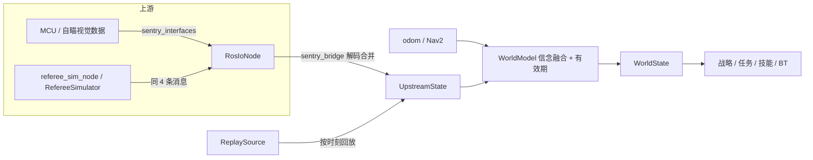

# 信念层（Belief）数据契约

> 本文档是信念层字段的单一事实来源：记录 `WorldState` 各子状态的字段含义、单位、来源消息字段、
> 解码位置与有效性判定。类型定义见 `sentry_decision_core/include/sentry_decision_core/world_state.hpp`，
> 位段解码见 `referee_protocol.hpp`，消息契约见 `sentry_interfaces/msg/` 与 `docs/INTERFACES.md`。

## 1. 定位与数据流

- 决策（战略 / 任务 / 技能 / BT 节点）**只读信念层** `WorldState`，不直接接触 ROS。
- 信念层 `WorldModel::snapshot(now)` 从三个输入端口取数据并判新鲜度：`UpstreamSource` /
  `OdometrySource` / `NavigationSink`（`sentry_decision_core/include/sentry_decision_core/io.hpp`）。
- 输入端口有实机 / 仿真 / 回放三种实现，`WorldModel` 本身不感知差异。

- **实机**：`RosIoNode`（`sentry_decision_io`）订阅 4 条上行 + odom + `DecisionAck`，
  `sentry_bridge` 把消息字段合并进 `UpstreamState`。
- **本地仿真**：`referee_sim_node` 发同样的 4 条消息 + odom，`RosIoNode` 照常消费；
  离线 `decision_main` 用 ROS 无关的 `RefereeSimulator` + `NavSimulator`。
- **回放**：`ReplaySource`（`sentry_decision_core/include/sentry_decision_core/replay.hpp`）按时刻回放同一批上游数据。
- **串口字节层（P2.3b）尚未实现**：当前实机路径假设 MCU / 视觉侧已把数据发成上述 ROS 消息；
  `sentry_interfaces` 是决策与 auto-aim 之间的契约，auto-aim ↔ MCU 的字节帧见
  `auto-aim-new/docs/serial_protocol.md` §2。

## 2. 类型定义位置

| 内容 | 文件 |
| --- | --- |
| `WorldState` / `UpstreamState` / `SelfState` / `NavState` / `EnemyState` / `AllyRobot` | `src/sentry_decision_core/include/sentry_decision_core/world_state.hpp` |
| `GameStatus` / `EventCode` / `SentryInfo1/2/3` / `SentryStance` 与位段解码 | `src/sentry_decision_core/include/sentry_decision_core/referee_protocol.hpp` |
| 消息定义（上行 / 下行） | `src/sentry_interfaces/msg/*.msg` |
| 消息 -> `UpstreamState` 合并 | `src/sentry_decision_io/src/sentry_bridge.cpp` |
| 超时阈值 | `sentry_decision_core/include/sentry_decision_core/world_model.hpp`（`WorldTimeouts`） |
| 实机 IO 订阅 / 发布 | `src/sentry_decision_io/src/ros_io_node.cpp` |

## 3. 有效性判定

- `WorldModel` 分别对 upstream / odom / nav 按超时判定：默认 upstream 500ms、odom 500ms、nav 500ms
  （odom 可放宽以适配由点云回调驱动、约 10Hz 的 `/odometry`）。
- `RosIoNode` 额外要求 **`GameInfo` 与 `SentryInfoOnline` 都出现过**才返回就绪
  （`referee_sources_ready`）：只到其中一条时缺失字段会以默认 0 参与决策，可能被误判为「0 血 / 阵亡」。
- `upstream.valid=false` 时 `SafetySupervisor` 触发急停（撤销导航目标 + 速度清零）。
- 状态变化只打印一次（`upstream data stale / recovered` 等）。

## 4. UpstreamState 字段字典

| 字段 | 类型 / 单位 | 来源（消息字段） | 说明 |
| --- | --- | --- | --- |
| `stamp` / `valid` | TimePoint / bool | IO 侧 | 由 `WorldModel` 按 stamp + 超时消费 |
| `game_status` | `GameStatus` | `GameInfo.game_status` | `decode_game_status`：0-5，其余 kUnknown |
| `game_time_remaining` | int / s | `GameInfo.game_time_remaining` | 剩余时间 |
| `coins` | int | `GameInfo.coin_remaining` | 己方剩余金币 |
| `manual_point` | Point2D / m | `GameInfo.manual_point_x/y` | 手动目标点（minimap 系） |
| `manual_key` | int | `GameInfo.manual_key` | 手动按键 |
| `detect_color` | int | `GameInfo.detect_color` | 红蓝方，**编码待确认，当前只存不判** |
| `base_hp` | int | `TeamInfo.base_hp` | 己方基地血量 |
| `our_outpost_hp` | int | `TeamInfo.outpost_hp` | 己方前哨站血量 |
| `enemy_outpost_hp` | int | `GameInfo.enemy_outpost_hp` | 敌方前哨站血量 |
| `enemy_base_hp` | int | `GameInfo.enemy_base_hp` | 敌方基地血量 |
| `can_rebuild_outpost` | bool | `GameInfo.can_rebuild_outpost` | 己方是否可重建前哨站 |
| `self_hp` | int | `SentryInfoOnline.self_health` | 自身血量 |
| `self_ammo` | int | `SentryInfoOnline.bullets_remaining` | 自身允许发弹量 |
| `cooling_value` | int | `SentryInfoOnline.cooling_value` | 冷却值 |
| `heat_limit` | int | `SentryInfoOnline.heat_limit` | 热量上限 |
| `current_heat` | int | `SentryInfoOnline.current_heat` | 当前热量 |
| `energy_ratio` | int / % | `SentryInfoOnline.energy_ratio` | 底盘能量比例 |
| `gimbal_yaw_deg` | double / deg | `SentryInfoOnline.speed_monitor_angle` | 测速模块朝向（正北 0） |
| `capacitor_capacity` | int / % | `SentryInfoOffline.capacitor_capacity` | 电容容量 |
| `event` | `EventCode` | `GameInfo.event_code` | `decode_event_code` 位段，含增益点占领 / 能量机关等 |
| `info1` | `SentryInfo1` | `SentryInfoOnline.sentry_info_1` | 兑换与复活（`can_free/instant_resurrect`、成本等） |
| `info2` | `SentryInfo2` | `SentryInfoOnline.sentry_info_2` | 脱战、剩余可兑换、姿态（`stance`） |
| `info3` | `SentryInfo3` | `SentryInfoOnline.sentry_info_3` | 各姿态剩余时长 |

> 复活（规则 5.2.2）：`info1.can_free_resurrect`（bit 19）表示当前可否确认免费复活，
> 仿真裁判在待复活（`self_hp<=0`）期间置 1；`can_instant_resurrect`（bit 20）与成本（bit 21-30）
> 来自裁判。决策只消费标志，不感知读条；读条与结算建模在 `sentry_decision_sim`（见 ARCHITECTURE §14.4）。

> 注：`SentryInfoOnline.sentry_pos` 当前**未合并**；自身位姿来自 odom（见 `SelfState.pose`）。
> `SentryInfoOffline` 的目标锁定字段（`is_get` / `armor_pos` / `armor_num`）当前**未接入**（见 §7）。

## 5. SelfState 字段

| 字段 | 来源 | 说明 |
| --- | --- | --- |
| `pose` | `nav_msgs/Odometry`（`RosIoNode.odom_sub_`） | 位置 + 由四元数解出的 yaw；`odom_frame` 非空时经 TF `map->odom` 转为 map 系 |
| `vx` / `vy` / `wz` | odom twist | 速度 |
| `imu` | - | 保留，决策暂未使用 |
| `valid` | - | 由 `WorldModel` 按 odom 超时判定 |

## 6. NavState 字段

| 字段 | 来源 | 说明 |
| --- | --- | --- |
| `pose` / `current_goal` | `NavigationSink::status()` | 实机由 Nav2 action client 回写，仿真由 `NavSimulator` 回写 |
| `reached` / `failed` | 同上 | action result 的 SUCCEEDED / ABORTED |
| `valid` | - | 由 `WorldModel` 按 nav 超时判定 |

## 7. EnemyState / AllyRobot（当前留空，待接入）

当前**没有**任何 IO 代码填充以下字段，属于已知缺口（P3 暂留空）：

| 字段 | 期望来源 | 现状 |
| --- | --- | --- |
| `EnemyState.valid` / `position` / `target_valid` / `target_armor_id` | `SentryInfoOffline.is_get` / `armor_pos` / `armor_num` | 未合并，恒为 false / 空 |
| `WorldState.allies` | `TeamInfo.allies[4]` | 未合并，恒为空 |

影响：`enemy_valid` 恒为 false，网页面板「有效」行不会出现 enemy；依赖敌方位置 / 队友位置的策略不可用。
`IfEnemyOutpostDead` 用的是已接入的 `enemy_outpost_hp`，不受影响。接入时需确认话题名、频率与坐标系，
并更新本文档。雷达 / 变形相关字段当前已从协议与信念层移除，待启用时再加。

## 8. 变更流程

1. 协议位段变更：先改 `referee_protocol.hpp` 与对应单测；
2. 消息字段变更：改 `sentry_interfaces/msg/` 与 `sentry_bridge.cpp`；
3. 更新本文件对应表格与 `docs/INTERFACES.md`；
4. 若影响超时 / 有效性，同步 `WorldModel` 与 `RosIoNode`。
